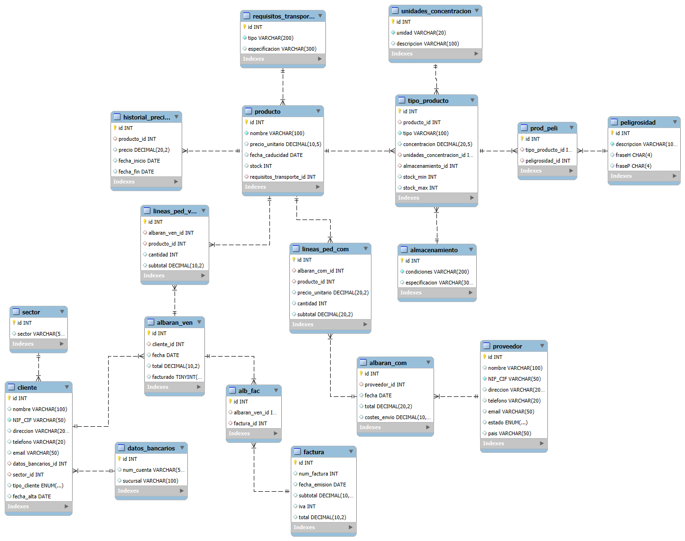

# Proyecto Final BBDD (1ºDAM)

Este proyecto consiste en el diseño y la implementación de una base de datos para una distribuidora de productos químicos.

## :bookmark_tabs: Descripción del Proyecto
El objetivo principal es estructurar una base de datos eficiente y normalizada que permita gestionar una empresa distribuidora: productos, almacen, compras, proveedores, ventas y clientes.

## 🛠️ Tecnologías Utilizadas
- Sistema de gestión de bases de datos: MySQL 
- Lenguaje de modelado: SQL
- Herramientas adicionales MySQL Workbench, Visual Paradigm, PartyRock.

## :bar_chart: Modelo Entidad-Relacion
El modelo E-R fue diseñado siguiendo principios de normalización hasta 3FN

## :file_folder: Scripts Incluidos
- `ScriptCreacionBDquimicos.sql`: Contiene las sentencias para la creación de BD y de sus tablas.
- `ScriptDatosBDquimicos.sql`: contiene datos de prueba para la base.

## 🧪 Pruebas y Validaciones

## :woman: Autor
**Uxía RD** - [GitHub](https://github.com/uxiarddmg)